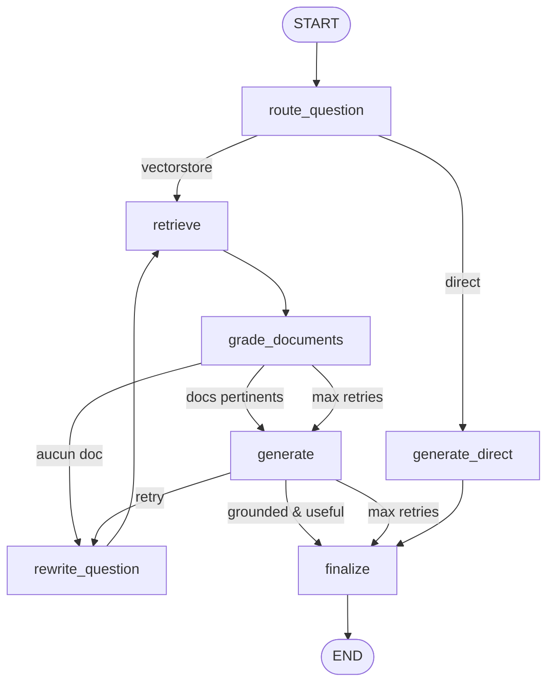

# Agentic RAG — Intelligence Artificielle

Système **RAG agentique** complet développé avec **LangGraph** pour répondre à des questions complexes à partir d'une base documentaire sur l'Intelligence Artificielle (ML, Deep Learning, NLP, RAG, LangGraph, Éthique).

## Domaine choisi

**Informatique — Intelligence Artificielle** : 6 documents Markdown couvrant les fondamentaux du ML au déploiement responsable.

## Architecture



### Nœuds du graphe

| Nœud | Rôle |
|------|------|
| `route_question` | Décide si une recherche documentaire est nécessaire |
| `retrieve` | Recherche vectorielle (Chroma + embeddings OpenAI) |
| `grade_documents` | Filtre les documents pertinents (LLM grader) |
| `rewrite_question` | Reformule la requête si résultats insuffisants |
| `generate` | Génère la réponse à partir du contexte |
| `generate_direct` | Réponse sans retrieval (salutations, hors sujet) |
| `finalize` | Ajoute les sources et met à jour la mémoire |

### State & Mémoire

L'état `AgentState` transporte : messages, question, documents, documents gradés, génération, route, compteur de retries et sources.

La **mémoire conversationnelle** utilise `MemorySaver` avec un `thread_id` pour persister l'historique entre les tours.

### Outils

- `search_documents` : recherche sémantique dans la base
- `list_document_topics` : liste des thèmes disponibles

## Installation

```bash
python -m venv .venv
.venv\Scripts\activate        # Windows
pip install -r requirements.txt
copy .env.example .env          # puis renseigner OPENAI_API_KEY
```

## Utilisation

```bash
# 1. Construire l'index vectoriel
python scripts/build_index.py

# 2. Visualiser le graphe
python scripts/visualize_graph.py

# 3. Mode interactif
python main.py

# 4. Évaluation (20 questions)
python scripts/evaluate.py
```

## Structure du projet

```
ai-agentic/
├── data/documents/          # Base documentaire (6 fichiers MD)
├── evaluation/questions.json # 10 simples + 10 complexes
├── scripts/
│   ├── build_index.py
│   ├── evaluate.py
│   └── visualize_graph.py
├── src/
│   ├── config.py            # Configuration
│   ├── models.py            # LLM & embeddings
│   ├── document_loader.py   # Indexation Chroma
│   ├── state.py             # État du graphe
│   ├── tools.py             # Outils agent
│   └── graph.py             # Graphe LangGraph
├── main.py
└── output/                  # Graphe + résultats d'évaluation
```

## Évaluation

Le script `evaluate.py` teste **10 questions simples** et **10 questions complexes**, et enregistre pour chaque question :

- Temps de réponse
- Documents récupérés et sources
- Nombre de retries (reformulations)
- Réponse complète

Analysez les résultats JSON dans `output/` pour comparer qualité, latence et pertinence des documents.

## Différence avec `create_agent`

Ce projet implémente manuellement la boucle de raisonnement avec LangGraph (`StateGraph`, nœuds, arêtes conditionnelles, checkpointer) au lieu d'utiliser `create_agent` de LangChain qui encapsule une boucle ReAct pré-construite.
